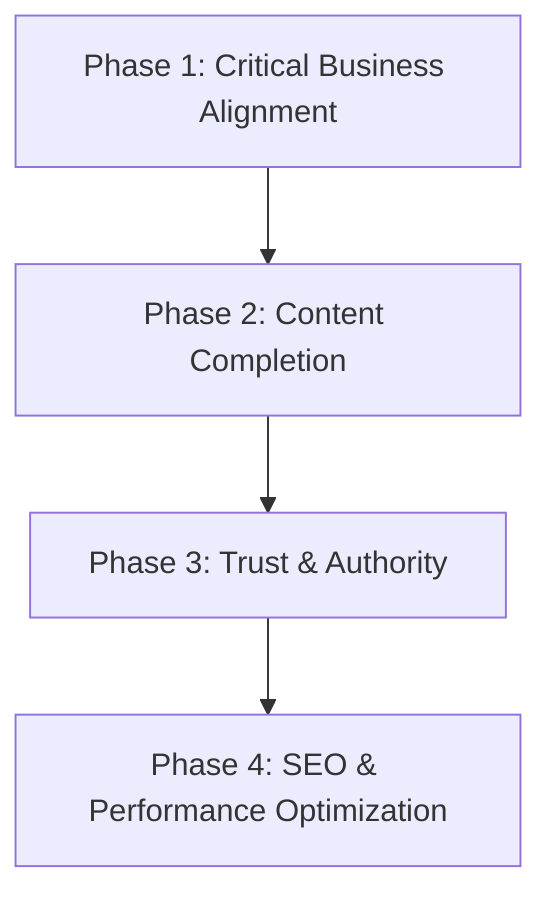

# WEBSITE ALIGNMENT MASTER PLAN: HEALTHCARE INFRASTRUCTURE & HOSPITAL CONSTRUCTION SPECIALIZATION

## Executive Summary
Following a comprehensive audit of the website's codebase (`src/app/` and `src/components/`) and a deep-dive analysis of the company's official documentation (*Epicshield E-brochure.pdf* and *epicshield profile Book.pdf*), we have identified a **fundamental misalignment** in the company's positioning, services, projects, and target audience representation.

The current website presents the company as a **generic commercial construction firm** specializing in generic office complexes, industrial parks, and residential projects with the tagline *"Creating Space. Building Legacy."*

However, the client's actual company—referred to as **Epicshield Surfaces** or **EpicShield Infrastructure Ltd**—is a **highly specialized private healthcare and hospital construction leader** with the tagline **"Creating Spaces to Save Lives"** (or *"Creating Space To Save Lives"*). Every aspect of their business is geared toward medical facility development, healthcare engineering (such as medical gas systems and cleanrooms), medical technology procurement, and hospital doors & windows manufacturing.

This document outlines the detailed findings of our audit, catalogs page-by-page gaps, maps required image placeholders, and provides a four-phase implementation roadmap to bring the website into absolute alignment with the client's actual operations and authority.

---

## Current Website Assessment
The current website fails to communicate the company's unique value proposition. If a private clinic owner, hospital administrator, or health ministry representative visits the website today, they will see generic commercial building services instead of specialized medical facility engineering.

* **Tagline & Identity**: The website uses a generic construction tagline. It misses the core life-saving purpose: *"Creating Spaces to Save Lives"*.
* **Business Type**: The website positions the company as a general contractor. The PDFs explicitly state: *"Unlike general contractors, we are exclusively committed to private healthcare & hospital construction."*
* **Core Offerings**: The website completely omits medical equipment supply, clinical technology integration, medical gas piping, operating theatre infrastructure, cleanrooms, and radiation-shielding doors.
* **Credibility Gap**: Instead of listing actual medical builds like the *Sokoban Hospital Project (Kumasi)* or the *Adenta Specialist Hospital*, the website lists fictional commercial towers and housing projects.
* **Team Misalignment**: Important clinical and administrative leaders are missing from the team page, and existing engineering bios lack mention of their healthcare construction and clinical engineering backgrounds.

---

## Missing Content
The following core information from the PDFs is completely missing from the current website:
1. **The True Company Story & Milestones (Profile Book, Page 4)**:
   * **2024**: Company Founded (January 23, 2024)
   * **2025**: Sokoban Hospital Project (Kumasi) & Healthcare Construction Expansion
   * **2026**: Adenta 50-Bed Specialist Hospital Project, Dubai Healthcare Construction Visits, China Hospital Visits, and participation in the China Hospital Construction Conference (CHCC)
   * **2030**: Regional Expansion Vision (expanding to 5 additional African countries)
2. **International Exposure & Global Best Practices (Profile Book, Pages 10-14)**:
   * Sourcing and learning modular construction systems, smart hospital technologies, and hospital automation in Dubai and China.
   * Visits to global medical equipment manufacturers and hospital technology providers to establish strategic supply chain partnerships.
3. **Clinical Governance**:
   * Complete omission of clinical operational alignment and clinical advisory. The website lacks clinical perspective on how the physical layout affects nursing workflows and patient outcomes.
4. **Specialized Hospital Sub-systems (Profile Book, Page 7 & 9)**:
   * Medical Gas Systems, cleanrooms, ICU doors, theatre doors, and radiation-shielding lead-lined doors.

---

## Required Content Updates (Page-by-Page)

### 1. Homepage (`src/app/page.tsx`)
* **Modify Hero Section**:
  * Change the main heading/tagline from *"Creating Space. Building Legacy."* to **"Creating Spaces to Save Lives."**
  * Rewrite the introduction to focus on: *"We design, construct, and equip world-class, patient-focused private hospitals and healthcare facilities across Ghana and Africa."*
  * Change the eyebrow tag from *"Ghana's Premier Construction Company"* to **"Ghana's Premier Healthcare & Hospital Construction Specialists"**.
* **Modify Stats Strip**:
  * Replace the inflated/generic stats (*47+ Projects Delivered, 18 Countries Reached, 250+ Structures Completed*) with the actual milestone-based stats:
    * **2 Flagship Hospitals** (Sokoban Kumasi & Adenta Accra)
    * **50-Bed & 33-Bed Projects** (Adenta Specialist Hospital)
    * **20-Bed Comprehensive Unit** (Sokoban Hospital)
    * **10+ Global Manufacturer Partners** (Dubai, China, Turkey)
    * **10+ Years Leadership Experience** in Medical Construction
* **Modify Services Preview**:
  * Replace the generic services with the actual specialized divisions (Hospital Construction, Medical Technology, Healthcare Engineering, Hospital Doors & Windows).
* **Modify Featured Case Study**:
  * Replace the generic *"Kumasi Commercial Complex"* with the actual **Sokoban Hospital Project (Kumasi)** or the **Adenta Specialist Hospital Project**.

### 2. About Page (`src/app/about/page.tsx`)
* **Modify Profile Summary**:
  * Update `profile.summary` and `profile.focus` in `src/lib/brochure-content.ts` to reflect the exclusive commitment to private healthcare and hospital infrastructure.
* **Update Core Values (SMART Goals)**:
  * Revise the description of the SMART values to align with medical standards (e.g., Specific = *private healthcare construction only*; Measurable = *tracking against international health, infection-control, and safety standards*).
* **Inject Company Story Timeline**:
  * Replace or update the general process timeline with the actual company timeline (2024 Founding, 2025 Sokoban, 2026 Adenta & Dubai/China visits, 2030 Regional Expansion).
* **Add "Why Epicshield" Value Proposition**:
  * Create a section explaining their competitive advantages: *Healthcare Specialization, International Exposure, Technical MEP/Biomedical Expertise, Integrated Solutions, and Strategic Global Partnerships*.
* **Complete Team Roster**:
  * Add the two missing team members (Bernice Afi Kumah and Erica Naa Mansa Awindor).
  * Rewrite bios for existing members to reflect their medical infrastructure experience:
    * *Joshua Cobbinah*: CEO, Hospital Infrastructure Specialist.
    * *Evans Adusei*: Director of Projects, Civil/Structural Engineer and Hospital Infrastructure Specialist.
    * *Samuel Amponsah-Tuffour*: Director & CTO (Healthcare), Biomedical Engineering Manager.
    * *Wisdom Kaley*: Chief Quantity Surveyor, specialized in hospital costing.
    * *Ebenezer Attah Koomson*: Chief Architect, hospital & healthcare facility design specialist.
    * *Erica Naa Mansa Awindor*: Director of Clinical Affairs (20+ years of clinical operations and nursing experience to bridge infrastructure and patient care).
    * *Bernice Afi Kumah*: Account Clerk | HR Manager (nursing theory & commerce background).

### 3. Services Page (`src/app/services/page.tsx` & `src/app/services/[id]/page.tsx`)
* **Replace Core Service Categories**:
  * Update the services list to display the company's true technical capabilities:
    1. **Healthcare Infrastructure / Hospital Construction**: Full-cycle design, civil work, and turnkey delivery of patient-focused hospitals, clinics, and wards.
    2. **Medical Technology & Equipment Integration**: Lifecycle planning, procurement, installation, calibration, and maintenance of medical hardware.
    3. **Healthcare Engineering Systems**: Medical gas distribution piping, cleanrooms, specialized hospital HVAC (laminar flow, HEPA filtration), and clinical MEP.
    4. **Hospital Doors & Windows**: Specialized hospital-grade doors (lead-lined for X-ray/radiation safety, fire-rated doors, airtight operating theatre doors, sliding ICU doors) and uPVC/Aluminium architectural systems.
    5. **Facility Development & Management**: Technical operation and clinical facilities support.

### 4. Projects Page (`src/app/projects/page.tsx` & `src/app/projects/[id]/page.tsx`)
* **Remove Fictional Projects**:
  * Delete *Tema Industrial Park Phase 2* and *Accra Heights Residential* from `src/lib/site-content.ts`.
* **Insert Actual Case Studies**:
  * **Sokoban Hospital Project (Kumasi)**:
    * *Details*: 20-bed unit, Outpatient Department (OPD), Male/Female wards, Intensive Care Unit (ICU), Operating Theatre, Consulting rooms, Emergency Unit, CT Scan building, X-Ray unit, Medical Gas Generation system, Temporary Mortuary, Pharmacy, Dialysis center, Isolation ward, Private/VIP wards, Physiotherapy unit, and Offices.
    * *Status*: Under Construction / In Progress.
  * **Adenta Specialist Hospital Project (Accra)**:
    * *Details*: 50-Bed & 33-Bed specialist hospital build, modular infrastructure setup, and medical equipment technology integration.
    * *Status*: In Progress / Expansion phase.
  * **International Medical Technology Sourcing & Exposure**:
    * *Details*: Dubai & China research visits (2026), attendance at the China Hospital Construction Conference (CHCC) to source smart hospital automation, modular building systems, and partners.
    * *Status*: Completed/Active.

### 5. Divisions Page (`src/app/divisions/page.tsx` & `src/app/divisions/[id]/page.tsx`)
* **Update Divisions**:
  * Align the four divisions with their specialized healthcare counterparts:
    1. *Hospital Construction & Turnkey Development*
    2. *Medical Technology & Equipping*
    3. *Healthcare Engineering & MEP (Medical Gas, cleanrooms, specialist HVAC)*
    4. *Specialized Hospital Doors & Windows Manufacturing*

### 6. Contact Page (`src/app/contact/page.tsx`)
* **Align Offices and Contact Details**:
  * Show both strategic locations to build local trust:
    * **Corporate Head Office**: Achimota Accra, Ghana (Phone: +233 551713435)
    * **Regional / Project Office**: Odaaso Sokoban, Kumasi, Ghana (Phone: +233 302 942 185)
  * Add the official LinkedIn Company Page link: `https://www.linkedin.com/company/epicshield-infrastructure-limited/`

---

## Required New Sections

1. **"International Exposure & Global Best Practices" Section (Homepage or About Page)**:
   * Showcase the CEO's study tours to Dubai and China and the China Hospital Construction Conference (CHCC). Detail how these visits inform Epicshield's modular hospital construction systems and smart hospital automation capabilities.
2. **"Specialized Medical Building Solutions" Section (Services Page)**:
   * A dedicated section highlighting specialized technical doors (e.g., radiation-shielding lead-lined doors for X-ray rooms, fire-rated doors, airtight theatre doors).
3. **"Clinical Workflow Integration" Section (About or Services Page)**:
   * Underline how the company incorporates clinical advisory (led by the Director of Clinical Affairs) to ensure hospital floor plans, wards, and equipment layouts conform to clinical nursing workflows and patient safety guidelines.

---

## Messaging Improvements
To correct the tone of the site from generic commercial construction to high-authority medical infrastructure, the following wording replacements must be made:

| Generic Term (Current Site) | Healthcare-Aligned Term (Expected) | Source / Context |
| :--- | :--- | :--- |
| "Creating Space. Building Legacy." | "Creating Spaces to Save Lives" | E-brochure Page 1 / Profile Book Page 24 |
| "Commercial & Institutional Construction" | "Hospital Construction & Facility Development" | Profile Book Page 3 |
| "Civil & Infrastructure" | "Healthcare Infrastructure & Specialist Clinics" | Profile Book Page 6 |
| "MEP & Technical Systems" | "Healthcare Engineering & Medical Gas Systems" | Profile Book Page 7 |
| "Project Management" | "Clinical Equipment Planning & Turnkey Delivery" | Profile Book Page 8 |
| "Kumasi Commercial Complex" | "Sokoban Hospital Project (Kumasi)" | E-brochure Page 10 |
| "Accra Heights Residential" | "Adenta Specialist Hospital (Accra)" | Profile Book Page 15 |
| "infrastructure projects across Africa" | "healthcare infrastructure and hospital construction" | E-brochure Page 3 |
| "General construction firm" | "Dedicated leader in private healthcare construction" | E-brochure Page 3 |

---

## Image Placeholder Map
Since the actual images for these healthcare projects and specialized systems do not yet exist in the codebase assets, we must map out placeholders to prevent empty sections or the use of generic commercial building images.

* **Placeholder 1**: Sokoban Hospital construction site photo (showing structural progress or advanced MEP/medical gas piping installation).
  * *Associated Section*: Homepage Hero background and Sokoban Project detail page.
  * *Recommended Image Type*: High-quality photo of hospital framing, medical gas manifolds, or building rendering.
* **Placeholder 2**: Adenta Specialist Hospital building exterior rendering.
  * *Associated Section*: Projects page / Adenta project showcase.
  * *Recommended Image Type*: 3D architectural visualization of a modern, multi-story specialist hospital building.
* **Placeholder 3**: Operating Theatre cleanroom layout.
  * *Associated Section*: Healthcare Engineering service detail page.
  * *Recommended Image Type*: Interior shot of a sterile operating theatre with airtight doors and laminar flow ceiling diffusers.
* **Placeholder 4**: Lead-Lined radiation protection door.
  * *Associated Section*: Hospital Doors & Windows service detail page.
  * *Recommended Image Type*: Product photo showing the installation of a lead-lined door in a diagnostic imaging (X-ray/CT) room.
* **Placeholder 5**: ICU sliding doors and patient recovery ward layout.
  * *Associated Section*: Hospital Doors & Windows service detail page.
  * *Recommended Image Type*: Modern, wide-opening ICU sliding door assembly in an active hospital wing.
* **Placeholder 6**: Medical Gas manifold piping and control panel.
  * *Associated Section*: Healthcare Engineering systems section.
  * *Recommended Image Type*: Technical close-up of oxygen/nitrous oxide gas pipelines, control valves, and alarm panels.
* **Placeholder 7**: Joshua Cobbinah during Dubai Healthcare Construction visits.
  * *Associated Section*: About Page (International Exposure section).
  * *Recommended Image Type*: Professional photo of directors at a Dubai healthcare design conference or modular manufacturing facility.
* **Placeholder 8**: China Hospital Construction Conference (CHCC) team attendance.
  * *Associated Section*: About Page (International Exposure section).
  * *Recommended Image Type*: Booth or seminar photo from CHCC, demonstrating engagement with medical technology suppliers.
* **Placeholder 9**: Erica Naa Mansa Awindor professional headshot.
  * *Associated Section*: About Page (Leadership team grid).
  * *Recommended Image Type*: Professional business portrait of a clinical specialist/director.
* **Placeholder 10**: Bernice Afi Kumah professional headshot.
  * *Associated Section*: About Page (Leadership team grid).
  * *Recommended Image Type*: Professional business portrait of an administrative/financial officer.

---

## SEO Improvements
The current website targeting is too broad ("construction", "engineering", "infrastructure"). To capture high-value organic search traffic from private clinic owners, medical developers, and hospital administrators, the following SEO optimizations are recommended:

* **Page Title Tags**:
  * *Homepage*: `Epicshield Infrastructure | Hospital Construction & Medical Technology Ghana`
  * *About Page*: `About Epicshield | Specialists in Private Healthcare Facility Construction`
  * *Services Page*: `Healthcare Engineering Systems, Medical Gas, & Cleanrooms | Epicshield`
  * *Projects Page*: `Healthcare Infrastructure Portfolio & Hospital Builds | Epicshield`
* **Meta Descriptions**:
  * *"Epicshield Infrastructure is Ghana's premier private hospital construction and healthcare engineering company. We deliver turnkey medical facilities, cleanrooms, medical gas systems, and specialized hospital doors."*
* **Target Keywords**:
  * Primary: `hospital construction Ghana`, `healthcare facility builders Africa`, `medical gas piping installation Accra`, `operating theatre cleanrooms Kumasi`, `private clinic construction`.
  * Secondary: `lead-lined doors Ghana`, `hospital ICU doors`, `medical technology procurement Accra`, `clinical engineering services`.
* **Structured Data (Schema.org)**:
  * Implement `LocalBusiness` schema with `medicalService` or `constructionBusiness` sub-types.
  * Explicitly register both the Accra and Kumasi addresses in the schema.

---

## Implementation Phases

### Phase 1 – Critical Business Alignment
* **Goal**: Correct the primary positioning and branding of the entire website.
* **Actions**:
  * Update header, footer, and homepage metadata to rename the tagline to **"Creating Spaces to Save Lives"** and set the company name to **Epicshield Infrastructure**.
  * Rewrite the hero section copy of the homepage to explicitly state the private healthcare construction focus.
  * Revise the main services listed in `brochure-content.ts` to healthcare infrastructure, healthcare engineering, medical technology, and hospital doors.
  * Update metadata in `src/app/layout.tsx`.

### Phase 2 – Content Completion
* **Goal**: Deliver detailed information on specific service offerings and divisions.
* **Actions**:
  * Add the sub-pages for specialized healthcare services (medical gas piping, cleanrooms, radiation doors).
  * Populate division detail pages (`/divisions/[id]`) with healthcare-focused descriptions.
  * Incorporate clinical advisory explanations showing how the firm integrates clinical workflows into hospital architectural layouts.

### Phase 3 – Trust & Authority
* **Goal**: Establish deep credibility using real-world project tracking, international exposure, and team expertise.
* **Actions**:
  * Remove generic commercial projects and write the detailed case studies for **Sokoban Hospital Project (Kumasi)** and **Adenta Specialist Hospital**.
  * Add the two missing team members: *Erica Naa Mansa Awindor* (Director of Clinical Affairs) and *Bernice Afi Kumah* (HR/Account Clerk).
  * Update all leadership bios to emphasize hospital construction, PMP, NEBOSH, and biomedical credentials.
  * Add the "International Exposure" section (Dubai and China visits, CHCC conference, manufacturer visits).

### Phase 4 – Optimization
* **Goal**: Maximize search engine visibility and accessibility.
* **Actions**:
  * Implement target keyword optimization in headings (`h1`, `h2`) and body copy.
  * Embed structured schema markup representing a specialized healthcare builder.
  * Align the contact page to list both Achimota Accra (Corporate Office) and Odaaso Sokoban Kumasi (Project Office) with correct phone numbers and LinkedIn links.

---

## Final Vision
Once all updates are implemented, visitors will immediately recognize Epicshield as the **foremost specialist in hospital construction and healthcare engineering in Ghana and West Africa**. 

Instead of looking like one of hundreds of general contractors, Epicshield will stand out as a highly technical, clinically informed, and globally connected partner capable of planning, designing, building, equipping, and commissioning complex medical facilities that directly improve healthcare delivery and save lives.
